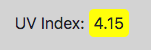
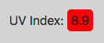

# Weather Dashboard

## Description

The purpose of this project is to demonstrate my ability to work with API's. This project features two API's from [Open Weather Map](https://openweathermap.org/); the [Current Weather Data API](https://openweathermap.org/current), which was used to pull data to get the current temperature, humidity, and wind speed. This API was also used to get the inputted city's longitude and latitude and feed it into the [One Call API](https://openweathermap.org/api/one-call-api) to grab the 5-day Forecast for the city, as well as the current UV Index. This project features the use of Moment.js to retrieve the current date and the future dates for the forecast. It also features the use of saving searched cities to local storage so that the user can click on them again and have that previously searched city populate the dashboard.

Deployed Project: https://eroux13.github.io/weather_dashboard

## How it Works

This application updates dynamically according to the user's inputted city search. 

After a city is search, it is saved to local storage and will display on the page; allowing the user to click on the previously searched city and have it repopulate the page with its information.

The UV Index also updates according to the UV level. it highlights green for a favorable index, yellow for a moderate index, or red for a severe index.

